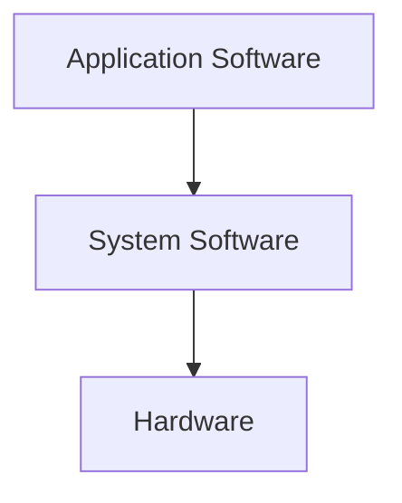
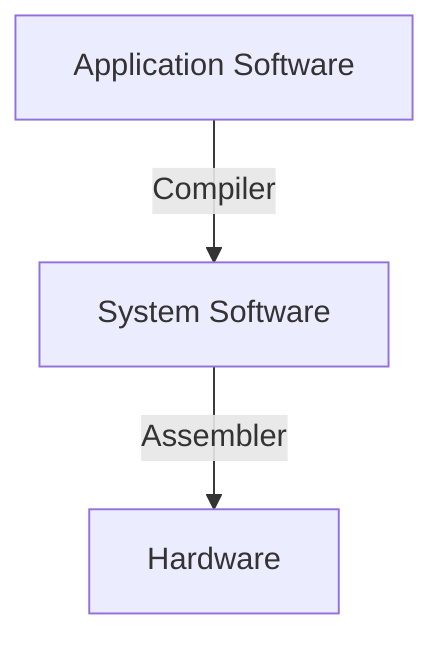

## Table of Contents
{: .no_toc .text-delta}

1. TOC
{:toc}

## Introduction
**컴퓨터의 발전**

- 컴퓨터 기술의 진전 
    - Moore의 법칙(반도체 집적회로의 성능이 2년마다 2배로 증가한다) 
- 새로운 응용 프로그램들이 실현 가능해짐 
    - 자동차 내부의 컴퓨터 
    - 스마트폰 
    - 인간 게놈 프로젝트 
    - WWW(World Wide Web), 웹 및 네트워크 
    - 검색 엔진 
- 모든 것이 컴퓨터화 되고 있음
    - IoT 등.. 냉장고, 커피포트, ...

**컴퓨터의 종류**
- 개인용
	- 일반적 / 다양한 소프트웨어
	- 비용/성능 다양
- 서버용
	- 네트워크 기반
	- 높은 capacity, performance, reliability가 보장되어야 함
	- 고가 / 대용량 / 고성능
	- 소형 ~ 빌딩 사이즈 규모 -> 다양함
- 슈퍼 컴퓨터
	- 복잡한 과학적 / 공학적 계산에 사용
	- 초고성능, but 초고가 / 전력소모 / 유지비용 등의 문제
- 임베디드용
	- 시스템의 요소로서 구성되어 있음

 
- 1 Byte = 8 bits 
- Kilobyte: 2^10 bytes = 1024 bytes 
- Megabyte: 2^20 bytes = 1024\*1024 bytes 
- Gigabyte: 2^30 bytes = 1024^3 bytes 
- Terabyte: 2^40 bytes = 1024^4 bytes 
- Petabyte: 2^50 bytes = 1024^5 bytes 
- Exabyte: 2^60 bytes = 1024^6 bytes 
## 8 Great Ideas in Computer Architecture
- Moore's Law를 위한 디자인
- design 간결화, 단수화 하기 위해 추상적 개념 사용
- 공통되는 / 일반적인 부분을 빠르게 함
- parallelism을 통한 성능 향상
- pipelining을 통한 성능 향상
- prediction을 통한 성능 향상
- 메모리 체계
- redundancy를 통한 dependability/reliability 향상 (RAID)
## Below Your Program

- Application Software
	- high-level의 언어로 쓰임
- System Software
	- compiler, os
	- high-level language를 기계어 번역
	- os : service code
		- input / output 조절
		- memory, storage 관리
		- task scheduling, sharing resources
- Hardware
	- processor, memory, I/O controllers

## Under the Covers
**Components of a Computer**
- 모든 종류의 컴퓨터는 같은 요소들을 갖추고 있다.
	- PC or 서버 or 임베디드
- Input/Output 갖춤
	- 유저-인터페이스 기기
		- display, keyboard, mouse
	- storage
		- HDD, CD/DVD, flash, SSD
	- network adapter
		- Connection with other computer
**Touchscreen**
- PostPC 장치들
- keyboard, mouse 대체
- Resistive, Capacitive의 센서 타입이 있음
	- 대부분이 Capacitive 사용
	- Capacitive는 동시에 여러 손가락 인식하는 멀티 터치 사용 가능

**Through The Looking Glass**
- Screen : 시각적 그림 요소 (픽셀)
	- 픽셀당 연속되는 프레임 버퍼 메모리의 순서대로 화면에 보여지는 것으로 볼 수 있음
	- 연속되는 픽셀들의 표현 집합 -> 그림/움직이는 그림 표현

**opening the Box**
분해
- Capacative multitouch LCD Screen / 3.8V 25Wh battery / Computer board ...
- etc.

Inside the Processor (CPU)
- Datapath : 데이터의 작업 수행
- Control : Datapach 순서, memory, etc. 등을 제어
- Cache memory
	- 데이터에 빠르게 접근하기 위한 고속의 SRAM memory

**Abstractions**
복잡한 문제 단순화

- 유연할 수 있도록 도와줘서 low-level의 복잡성을 줄여준다.

- Instruction set architecture(ISA, 명령어 집합 구조)
	- 하드웨어/소프트웨어 인터페이스
	  소프트웨어는 instruction으로 구성되어 있고,
	  하드웨어는 이걸 실행 / instruction을 통한 데이터 교환
- Application binary interface
	- The ISA+ system software 인터페이스]
	- 기초적인 세부사항과 인터페이스

**Data를 위한 안전한 장소**
- 휘발성 메인 메모리(Volatile main memory) - DRAM이 여기에 속함
	- 전원이 꺼지면 명령과 데이터 손실
- 비휘발성 보조 메모리(Non-volatile secondary memory)
	- Magnetic disk(Hard-Disk Drive)
	- Flash memory(Solid-State Drive, Flash drive)
	- Optical disk(CD, DVD)

**Network**
- Communication, resource sharing, nonlocal access
- Local area network(LAN) : Ethernet
- Wide area network(WAN): the Internet
- Wireless network: Wifi, bluetooth
## Technologies for Building Processors and Memory
전자기술을 계속해서 진화
- capacity + performance UPUP
- cost는 감소

**반도체 기술**
Silicon : 반도체(자유전자 X 부도체의 성능 가짐 but 전자 이동시키면 전류가 흐르는 도체의 성능을 가질 수 있음)
- 성능을 변화시키기 위해 물질을 추가함 (실리콘에 기판 새겨넣음)
	- conductors (도체)
	- Insulators(부도체=절연체)
	- Switch

**집적 회로(Intergrated Circuit, IC)**
실리콘 웨이퍼에 패턴을 입히고, 칩을 새김
Yield(수율) : 웨이퍼당 동작하는 기판의 비율

※ Intel Core i7 Wafer는
300mm wafer에 280개의 칩이 있고, 32mm 공정으로 새겨짐
각 칩은 20.7\*10.5mm

## Performance
**Response Time, Throughput**
- Response Time
	- 하나의 task를 수행하는데 걸리는 시간
- Throughput
	- 단위 시간 동안 얼마나 많은 일을 하는지
- 응답 시간과 처리량은 무엇에 영향을 받는지
	- Processor 더 빠른 것으로 교체
	- 같은 종류 여러개
		- 하나의 작업을 나눠서 하진 않으므로
		  Response Time은 줄지 X, but 같은 시간에 더 많은 일을 할 수 있음
		  -> Throughput은 늘어남
	- 일반적으로 Response time을 줄이면 Throughput도 늘어나지만, Throughput을 늘린다고 Response Time도 줄어드는 건 아님
응답 시간에 초점

**상대적인 성능**
- 성능의 정의 = 1/실행시간

**실행시간 측정**
- Elapsed Time (경과 시간)
	- 모든 측면에서의 총 응답시간, 어떤 작업의 시작부터 끝까지 총 작업시간
		- Processing, I/O, Os Overhead, idle time 모두 포함
	- System performance를 결정하는데 사용됨 

- CPU Time
	- 주어진 일을 처리하는데 걸리는 시간 (순수한 CPU 시간)
		- I/O나 다른 작업을 하는데 사용된 시간 제외
	- user CPU time / sytem CPU time이 있음
	- 프로그램이 다르면 CPU와 시스템 성능에 대해서도 다르게 영향을 받음 (프로그램 마다 다르다. CPU의 영향을 많이 받을 수도 / 시스템의 영향을 많이 받을 수도)
**CPU Clocking**
- Clock period : 한 클럭 싸이클 기간. rising edge 후 다음 rising edge(동일행동) 까지 걸리는 시간
	- rising edge (LOW -> HIGH), falling edge (HIGH -> LOW)
	- 단위 : ps (e.g. 250ps = 0.25ns = 250\*10^-12s)
- Clock frequency(rate) : 초당 싸이클 수
	- 단위 : Hz (e.g. 4.0GHz = 4000MHz = 4.0\*10^9Hz)

한 싸이클 : rising edge 후, 다음 rising edge까지

Clock rate(clock cycles per second in MHz or GHz) : Clock Period(Clock cycle time)의 반전
	CC = 1/CR

**CPU Time**
성능 (cpu time 줄이기)는 아래와 같은 방법으로 향상될 수 있음
- clock cycle 수 줄이기
- clock rate 증가
- 일은 능률적으로 해서 적게 하되, 하나 하나의 일을 훨씬 빠르게 하는 것3
- cycle 수 대비 clock rate 조절 (clock rate 증가 -> clock cycle도 증가.. / clock cycle 감소 -> clock rate 감소... | 비율을 잘 맞추는게 중요함)

**Instruction Count and CPI**
instruction count
- program, ISA와 컴파일러 등에 의해 결정됨
CPI (Average Cycles per Instruction, CPI)
- Clock-cycles per instruction
- instruction 당 평균 cycle 수
	- cpu 하드웨어에 의해 결정됨 (CPU가 어떻게 구성되어지고 만들어져 있는지에 따라)
	- 만약 instruction이 다르면 -> CPI도 다름
	- instruction이 섞여 있으면 평균 CPI를 산출해야 함
	- clock cycles / instruction count
	- 하나의 instruction을 실행하는데 얼마나 많은 cycle이 필요하냐

|                       | GOOD | BAD | 설명                                        |
| --------------------- | ---- | --- | ----------------------------------------- |
| CPU Time              | ↓    | ↑   | 주어진 일을 처리하는데 걸리는 순수한 CPU 시간               |
| Clock period          | ↓    | ↑   | 한 클럭 싸이클의 기간                              |
| Clock frequency(rate) | ↑    | ↓   | 초당 싸이클 수                                  |
| Clock Cycle           | ↓    | ↑   | 한번 반복되는 것 or 반복되는 것의 횟수                   |
| Instruction Count     |      |     | 실행하는 프로그램의 명령어 갯수                         |
| CPI                   | ↓    | ↑   | instruction을 하나 실행하는데 얼마의 clock cycle이 드냐 |

`CPU Time = CPU Clock Cycles * Clock Cycle Time`
`CPU Time = CPU Clock Cycles / Clock Rate`

**Performance Summary**
성능 의존
- 알고리즘 : IC에 형향, CPI에 영향
- 프로그래밍 언어 : IC, CPI에 영향
- 컴파일러 : IC, CPI에 영향
- Instructions set architecture(ISA, 명령어 집합 구조) : IC, CPI, Clock Cycle Time에 영향
## The Power Wall
Wall이라는 용어를 Power/Memory에서 사용한다고 한다.
CMOS : Complementary Metal Oxide Semiconductor (상보형 금속 산화 반도체)이고, 마이크로프로세서나 SRAM 등 디지털 회로를 구성하는데 사용되는 IC의 한 종류
반도체 제조 기술의 하나로, *저전력 소비*, *높은 집적도*, *좋은 노이즈 면적 특성*, *비교적 저렴한 제조 비용* 등의 특징을 가지고 있다.

다음은 CMOS의 에너지 소비에 관한 설명이다.
- 동적 에너지 소비
  - CMOS는 주로 동적 에너지 소비를 가지고 있다.
  - 동적 에너지 소비는 전원이 공급된 상태에서 발생하는 에너지 소비를 의미하며, 주로 스위칭 작업 때문에 발생한다.
  - CMOS의 첫 에너지 소비는 동적 에너지로, clock frequency마다 on-off, off-on으로 스위치 방식으로 제어된다.
  - **Clock frequency에 따른 에너지 소비 제어**: CMOS 회로의 동작은 클록 주파수(clock frequency)에 따라서 제어됩니다. 클록 주파수는 시스템이 동작하는 속도를 결정하며, 클록 주파수가 높을수록 연산이 빠릅니다. CMOS에서는 클록 주파수가 높을 때, 즉 스위치가 빠르게 전환될 때에는 에너지 소비가 더 많이 발생합니다.
  - 1. **스위치 방식 제어**: CMOS에서는 전력 소비를 줄이기 위해 스위치 방식으로 동작합니다. 즉, 스위치가 on 또는 off 상태로 전환됩니다. 이러한 스위치 동작은 전기 신호의 변화를 유발하며, 이러한 변화가 에너지 소비의 주요 원인 중 하나입니다.
  CMOS 기술에서는 클록 주파수를 조절하고 스위치를 효율적으로 제어함으로써 전력 소비를 최적화하려고 합니다.

**Reducing Power**

- The Power Wall
	- 전력(P) = 전력(I)\*전압(V)
	- 전력 소모가 많으면 열이 발생 -> but 전력 소모는 늘면 안되고, 성능(Frequency = clock rate)는 늘려야 되고, 전압은 줄일 수 없다..
-> Multi-Core
## The Sea Change: The Switch from Uniprocessors to Multiprocessors
단일 프로세서 -> 멀티 프로세서로의 전환이 일어나고 있음
그 이유는, 단일 프로세서의 성능 증가가 꾸준히 일어나고 있긴 하지만, 전력소모, instruction 수준의 병렬처리, 메모리 지연 등에 의한 제한이 성능 증가를 더디게 만들었기 때문에, 멀티 프로세서로의 관심이 더욱 커지고 있다.

**MultiProcessors**
- 칩 안에 여러개의 processor들을 탑재한 것이다. (multi core)
multicore를 통한 성능 향상을 보려면, parallel 프로그래밍이 필요하다.
즉, 프로그램 자체가 바뀌어야 한다는 것인데, 이를 위해서는 프로그래머가 일일이 parallel 프로그래밍을 해야한다.
Load Balancing을 통해 다수의 프로세서가 비슷한 양의 일을 나눠서 하게 해야 효율적인데, 이걸 프로그래머가 일일이 맞추는 것은 굉장히 어렵다.
또한, communication과 synchronization의 최적하가 필요한데, 요것도 힘듬

instruction 수준의 parallism(하드웨어가 알아서 명령을 동시에 실행하는 것)
- 하드웨어가 다수의 명령을 동시에 알아서 처리함
- 프로그래머가 신경 쓰지 않아도 됨
## Real Stuff: Benchmarking the Intel Core i7
**SPEC CPU Benchmark** (Standard Performance Evaluation Corp)
실제 workload만한 작업을 시켜서 성능을 테스트하는 프로그램

**SPEC CPU2006**
- 선택한 여러 프로그램들을 실행하는데 총 경과된 시간
	- CPU에 집중된 프로그램들로, I/O는 무시할 만한 수준으로 하기에, CPU Performance에 초점을 맞춰 테스팅 할 수 있다.
- 기준머신에 대한 정규화 (기존에 기준으로 잡은 머신에 비해 얼마냐 향상되었는지 볼 수 있음)
- 성능비(performance ratio)들의 기하 평균으로 요약된다.

**SPEC Power Benchmark**
다른 workload 수준들에서 server의 전력 소모 측정
- performance : throughput으로 측정된다. 초당 수행한 단위 작업의 수로 측정됨
- ssj_ops는 (server side java operations per second)
- power: watts(W) (=J/s)
ssj_ops / W의 단위가 클 수록, 전력 대비 많은 작업을 수행한 것이므로, 클 수록 성능이 좋은 것으로 볼 수 있다.

## Fallacies and Pitfalls
컴퓨터의 어떤 부분을 향상시키면, 전체적인 성능에서도 비례적인 향상을 기대할 수 있다.

전체 작업 중 P%의 부분에서 S배의 성능이 향상되었을 때, 전체 시스템에서 최대 성능 향상은 위와 같다.
`개선 후의 실행시간 = (개선에 의해 영향을 받는 실행 시간 / 성능 향상 비율) + 영향을 받지 않는 실행 시간`
즉, 시스템의 한 부분의 성능이 향상되면, 전체 시스템의 성능 향상은 해당 시스템이 차지하는 비율에 비례해서만큼만 향상된다.
-> 뭘 하든 한 부분이 향상되면, 전체적으로 향상된다. but 시스템에서 가장 많은 부분을 차지하는 부분을 향상시키는게 가장 best이다.

**Fallacy : Low Power at Idle**
착오 : 유휴 상태에선 저전력인가??
load와 전력소모가 비례하진 않는다.

| Load(%) | Power(W) |
| ------- | -------- |
| 100     | 258      |
| 50      | 170      |
| 10      | 121      |

load와 전력소모가 비례하지 않음

프로세서를 설계할 때, load에 비례한 전력 소모가 이뤄질 수 있도록 하는게 가장 이상적이다.

**Fitfall: MIPS as a Performance Metric**
함정 : 성능 지표로서의 MIPS
MIPS (Millions of Instructions per second) 초당 몇백만개의 instruction 실행
예전에는 성능의 지표로 쓰였으나, MIPS는 많은 오해를 불러일으킬 수 있음
- 컴퓨터마다 ISA가 다름
- instruction 마다 복잡도가 다름 (CPI가 다름)
- 같은 CPU에서도 프로그램에 따라 CPI가 달라짐
-> MIPS를 하드웨어의 성능측정 단위라고 하기 어렵다.
앞서 본 SPEC의 Benchmark를 사용하는 것이 더 정확하다고 할 수 있다.

## Concluding Remarks
- Performance/cost는 증가하고 있다.
- 추상화의 계층적인 층 구조
	- 하드웨어, 소프트웨어 양 쪽 측면 모두 계층화 되고 있다. (?)
- instruction set architecture(ISA)
	- 하드웨어/소프트웨어 사이의 데이터/명령 교환(interface)
- Execution time : 성능 측정에 있어서 최고의 도구
- Power(전력소모)를 줄이는데에는 한계가 존재한다.
    - Voltage, Clock rate등을 봤을 때 어느정도 미미한 발전은 있을 수 있지만, 드라마틱한 발전을 기대하긴 힘들다.
    - 따라서, 성능 향상을 위해 parallelism을 사용한다.

---
CPU Time = instruction count \* CPI \* Clock Cycle Time (Clock Cycle Time \* Clock Cycle)
Performance는 Executino Time에 반비례한다.
